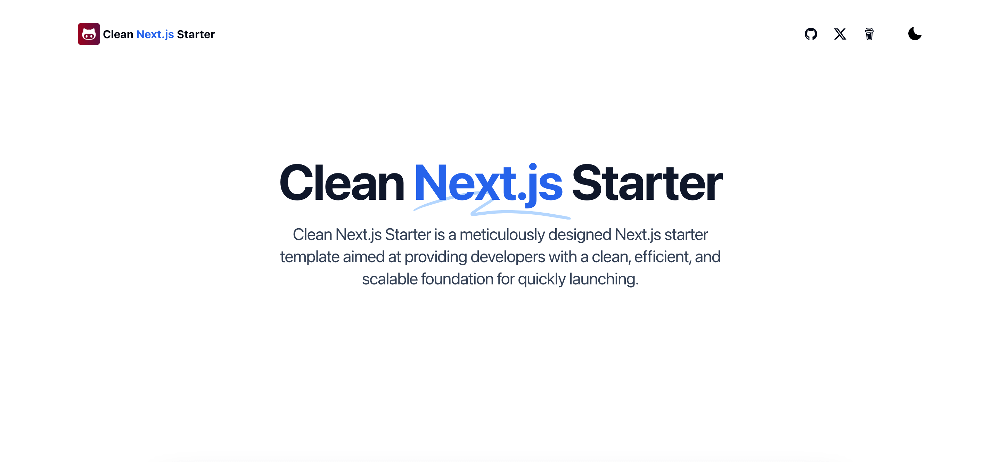

🌍 *[English](README.md) ∙ [简体中文](README-zh.md)*


# [Next.js 15 Starter](https://starter.weijunext.com/)

Next.js 15 Starter is a meticulously designed Next.js starter template aimed at providing developers with a clean, efficient, and scalable foundation for quickly launching.

Demo address：https://starter.weijunext.com

**More features are in development, aiming to complete the full development of the starter this year.**

[](https://www.starter.weijunext.com/)

## Tech Stack

Next.js 15 Starter is built on the following stack:

- Next.js – Frontend/Backend
- TailwindCSS – Styles
- Shadcn – UI
- Google Analytics - Analytics([How to use?](https://weijunext.com/article/979b9033-188c-4d88-bfff-6cf74d28420d))
- Vercel - Hosting


## Running Locally

After cloning the repo, you need to copy the `.env.example` file to create a `.env` file and fill in the required fields.

Then, run the application in the command line and it will be available at `http://localhost:3000`.

```bash
npm run dev
```

## Build Your Project

Edit these files:
- `.env` or `.env.local`
- `config/site.ts`, fill in your website information
- `public`, change logo file
- `public/robots.txt`
- `app/sitemap.ts`
s


## One-Click Deploy

Deploy the example using [Vercel](https://vercel.com?utm_source=github&utm_medium=readme&utm_campaign=vercel-examples):

[](https://vercel.com/new/clone?repository-url=https://github.com/weijunext/clean-nextjs-starter&project-name=&repository-name=clean-nextjs-starter&demo-title=CleanNextjsStarter&demo-description=Clean%20nextjs%20starter.&demo-url=https://starter.weijunext.com&demo-image=https://starter.weijunext.com/og.png)
